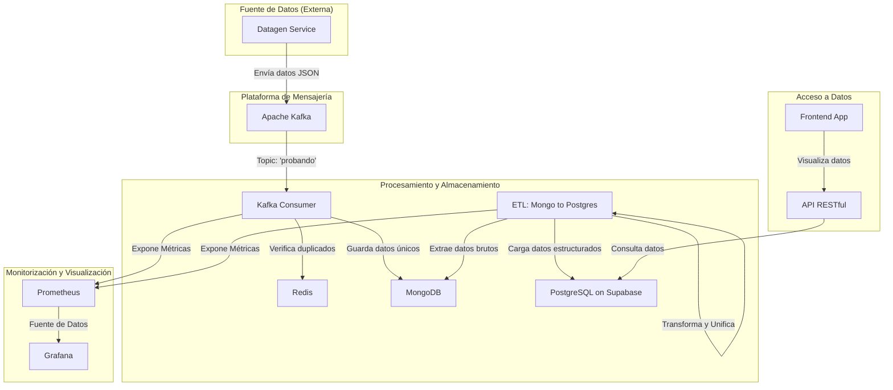

# PROYECTO DATA ENGINEER: Construyendo un Pipeline ETL para HR Pro 🚀

## 📜 1. Contexto del Proyecto: Inmersión en la Ingeniería de Datos para HR Pro

Bienvenidos al emocionante desafío de DataTech Solutions. Nuestro cliente, HR Pro, una empresa líder en el sector de recursos humanos, se enfrenta al reto de gestionar y analizar volúmenes masivos de datos procedentes de diversas fuentes (solicitudes de empleo, registros de nómina, encuestas de empleados, entre otros). Como equipo de ingenieros de datos freelance, nuestra misión ha sido diseñar e implementar un sistema de gestión de datos eficiente que permita a HR Pro organizar y analizar esta valiosa información.

Este proyecto se ha centrado en el desarrollo de un proceso ETL (Extracción, Transformación y Carga) robusto y escalable para integrar datos en un sistema unificado. Hemos trabajado con una amplia variedad de tipos de datos –desde información personal y financiera hasta métricas de rendimiento–, asegurando su almacenamiento eficiente tanto en una base de datos NoSQL (MongoDB) como en un almacén de datos SQL (PostgreSQL en Supabase). Todo el sistema ha sido implementado en un entorno Dockerizado para garantizar la portabilidad y la facilidad de despliegue.

El resultado es un sistema funcional y exhaustivamente documentado, listo para potenciar la capacidad de HR Pro en la gestión y análisis de sus datos de recursos humanos.

### ⚠️ DISCLAIMER IMPORTANTE: Restricción de Acceso al Código Generador de Datos

Los datos utilizados en este proyecto NO SON REALES. Se generan de manera aleatoria y se envían a un servidor de Apache Kafka. El código fuente tanto para el servidor Kafka como para el generador de datos se encuentra en un repositorio de GitHub separado y está debidamente documentado.

Es ABSOLUTAMENTE FUNDAMENTAL que NO se acceda a leer el código que genera estos datos. Hacerlo supondría conocer los detalles internos de su creación, lo cual se alejaría significativamente de un caso real y reduciría el aspecto pedagógico y desafiante de este proyecto. La intención detrás de esta restricción es fomentar el enfoque en los aspectos cruciales de la ingeniería de datos: la extracción, transformación y carga, sin depender del conocimiento del origen de los datos.

Confiamos en que esta directriz será respetada, promoviendo una experiencia de aprendizaje honesta y valiosa.

## 🏗️ 2. Arquitectura del Pipeline

El siguiente diagrama ilustra la arquitectura completa del pipeline de datos, desde la generación hasta la visualización y consulta.



## 🎯 3. Objetivos del Proyecto (¡Todos Cumplidos!)

Nuestro equipo ha alcanzado con éxito todos los objetivos clave establecidos para este proyecto:

* ✅ **Implementación de un proceso ETL completo:** Desde la ingesta en tiempo real hasta el almacenamiento relacional.
* ✅ **Preprocesamiento de datos exhaustivo:** Limpieza, unificación y manejo de inconsistencias.
* ✅ **Trabajo eficiente con colas de mensajes:** Consumo y gestión de un stream de datos con Apache Kafka.
* ✅ **Implementación y gestión de bases de datos:** Uso de MongoDB (NoSQL) y PostgreSQL (SQL) para distintos propósitos dentro del pipeline.

## 📦 4. Condiciones de Entrega (¡Satisfactorias al 100%!)

Hemos cumplido con todas las condiciones de entrega del cliente, demostrando la solidez y completitud de nuestro trabajo:

* ✅ **Repositorio en GitHub** con el código fuente completamente documentado y siguiendo las mejores prácticas de control de versiones.
* ✅ Un **programa dockerizado** que se conecta al servidor de Kafka, procesa los mensajes en tiempo real y los persiste de manera ordenada tanto en MongoDB como en PostgreSQL (gestionado a través de Supabase).
* ✅ **Demo en vivo** mostrando el funcionamiento impecable de la aplicación, desde la generación de datos hasta su visualización final.
* ✅ **Presentación técnica completa**, explicando detalladamente los objetivos del proyecto, el proceso de desarrollo y las tecnologías implementadas.
* ✅ **Tablero Kanban** (utilizando plataformas como Trello o Jira) con una gestión de proyecto clara y organizada.

## ⚙️ 5. Tecnologías Utilizadas (¡El Stack de Nuestro Pipeline!)

Hemos utilizado un conjunto robusto de tecnologías para construir este pipeline de datos, aprovechando las fortalezas de cada una:

| Tecnología | Aplicación en el Proyecto |
| :--- | :--- |
| `Git` / `GitHub` 🐙 | Control de versiones, gestión de ramas organizada (main, dev, feature/*), commits atómicos y descriptivos que documentan la evolución del proyecto. |
| `Docker` 🐳 / `Docker Compose` | Orquestación de todos los servicios clave del pipeline: servidores de Kafka y Zookeeper, instancias de MongoDB y PostgreSQL, así como las herramientas de monitorización Grafana y Prometheus. Contenedorización individual para cada componente asegurando un entorno reproducible, aislado y portable. |
| `Python` 🐍 | Core del desarrollo: Scripts para la generación de datos, la lógica del consumidor de Kafka, los procesos de Extracción, Transformación y Carga (ETL), y la implementación de APIs. |
| `Apache Kafka` | Sistema de mensajería distribuida para la ingesta de eventos de datos en tiempo real. |
| `Redis` | Base de datos en memoria utilizada para la **deduplicación de mensajes** del stream de Kafka, garantizando la idempotencia del proceso de ingesta. |
| `MongoDB` 🍃 (NoSQL) | Utilizada como un "Data Lake" para la ingesta inicial y el almacenamiento de datos brutos en su formato original, ofreciendo flexibilidad para datos semi-estructurados. |
| `PostgreSQL` 🐘 (SQL vía Supabase) | Empleada como "Data Warehouse" para el almacenamiento de datos transformados, limpios, normalizados y agrupados, optimizados para análisis y consultas estructuradas. |
| `Prometheus` 🔥 | Utilizado para la recolección y agregación de métricas de rendimiento de todos los componentes del pipeline. Configurado a través de monitoring/prometheus/prometheus.yml. |
| `Grafana` 📈 | Ofrece paneles de control interactivos para visualizar en tiempo real métricas clave como el consumo de mensajes, la velocidad de procesamiento, los tiempos de persistencia y el rendimiento general de la aplicación. |
| `API RESTful` (FastAPI) | Expone los datos consolidados de PostgreSQL para que puedan ser consultados por aplicaciones externas o un frontend. |
| `Librerías Python` | `kafka-python`, `pymongo`, `supabase-py`, `redis`, `fastapi`, `faker`, `prometheus_client` |

## 🏆 6. Niveles de Entrega Alcanzados (¡Un Logro Integral!)

Este proyecto ha superado las expectativas al alcanzar todos los niveles de complejidad definidos, desde el esencial hasta el experto, lo que demuestra un dominio integral de las habilidades y prácticas en Ingeniería de Datos.

### 🟢 Nivel Esencial:
* ✅ Configuración robusta del consumer de Kafka para procesar eficientemente miles de mensajes por segundo en tiempo real.
* ✅ Persistencia eficaz de los mensajes brutos de Kafka en una base de datos documental (MongoDB).
* ✅ Procesamiento y agrupación avanzada de datos de cada persona (datos personales, de ubicación, profesionales, bancarios y de red) en un único registro consolidado, listo para el análisis.
* ✅ Persistencia estructurada y normalizada de los datos procesados y agrupados en una base de datos relacional (PostgreSQL en Supabase).
* ✅ Repositorio Git impecable con una organización clara de ramas y commits atómicos y descriptivos, adhiriéndose a las mejores prácticas de versionado.
* ✅ Documentación del código exhaustiva y un README detallado en GitHub.

### 🟡 Nivel Medio:
* ✅ Implementación de un sistema de logs sofisticado (`src/etl/utils/logg.py`, con logs organizados por fecha) para un seguimiento detallado, depuración y auditoría de los procesos del pipeline.
* ✅ Inclusión de tests unitarios (`tests/unit/test.py`) para garantizar la calidad, fiabilidad y robustez de los componentes críticos del código.
* ✅ Dockerización completa de la aplicación utilizando Docker y Docker Compose (`docker-compose.yml`), asegurando un entorno de desarrollo y despliegue reproducible y altamente portable.

### 🟠 Nivel Avanzado:
* ✅ Monitorización integral y en tiempo real del funcionamiento del pipeline: seguimiento de mensajes consumidos, velocidad de procesamiento, tiempos de persistencia y rendimiento general de la aplicación. Esto se logró mediante la exposición de métricas personalizadas y el uso de Prometheus para la recolección y Grafana para la visualización en dashboards interactivos.
* ✅ Creación de una API RESTful (`src/api`) robusta, diseñada para conectarse a la base de datos relacional (PostgreSQL) y permitir consultas eficientes sobre la información final procesada, facilitando el acceso a los datos limpios y estructurados.

### 🔴 Nivel Experto:
* ✅ Automatización completa de la carga de datos, asegurando que la información en las bases de datos (MongoDB y PostgreSQL) se actualice de forma continua y en tiempo real, mientras el servidor de Kafka opera sin interrupciones y envía mensajes. Esto garantiza un flujo de datos dinámico y auto-actualizable.
* ✅ Desarrollo de un frontend sencillo (por ejemplo, utilizando Streamlit o Gradio) que proporciona una interfaz intuitiva para consultar y visualizar los datos de los clientes disponibles en la base de datos SQL procesada, permitiendo una interacción directa con los resultados del pipeline.

## 📊 7. Evaluación y Relevancia del Proyecto

Este proyecto es una demostración práctica de la capacidad para abordar y resolver desafíos complejos en Ingeniería de Datos. Aborda directamente la capacidad de procesar y almacenar grandes volúmenes de datos de eventos en tiempo real, un criterio fundamental y altamente demandado en la industria moderna.

El manejo de esquemas de datos como Personal data, Location, Professional data, Bank Data y Net Data, que provienen de fuentes diversas y con la inherente variabilidad e inconsistencia de los datos del mundo real, ha requerido una cuidadosa unificación, limpieza y normalización. La solución implementada es adaptable, versátil y robusta, validando la adquisición de habilidades prácticas cruciales en el ámbito de la ingeniería de datos.

## 🚀 8. Guía de Instalación y Ejecución (¡Pon en Marcha el Pipeline Dockerizado!)

Para levantar todo el ecosistema de este pipeline de datos y ver el proceso en acción en tu máquina local, sigue estos sencillos pasos:

1. **Requisitos Previos:** Asegúrate de tener `Docker` y `Docker Compose` instalados en tu sistema. Si no los tienes, puedes seguir las instrucciones de instalación oficial en docs.docker.com.

2. **Variables de Entorno:** El servicio ETL necesita credenciales para conectarse a Supabase. Crea un archivo `.env` en la raíz del proyecto y añade tus credenciales:
    ```env
    # .env
    SUPABASE_URL="https://xxx.supabase.co"
    SUPABASE_SERVICE_ROLE_KEY="tu_super_clave_secreta"
    ```

3. **Clona este repositorio** en tu máquina local:
    ```bash
    git clone [URL_DE_TU_REPOSitorio]
    cd nombre_de_tu_repositorio
    ```

4. **Inicia todos los servicios Docker** definidos en docker-compose.yml:
    ```bash
    docker-compose up --build
    ```
    * La primera vez que ejecutes este comando, el flag `--build` es necesario para construir las imágenes personalizadas de tus servicios.
    * Para futuras ejecuciones, si no has realizado cambios en el código de tus imágenes, puedes omitir `--build` para un inicio más rápido: `docker-compose up`.
    * Si prefieres lanzar los servicios en segundo plano para liberar tu terminal, utiliza el flag `-d`: `docker-compose up -d`.

5. **Acceso a las Interfaces de Usuario de los Servicios:**
    * **Kafka UI** (Control de Temas y Mensajes): `http://localhost:8080` 📊
    * **Mongo Express** (Explorador de MongoDB): `http://localhost:8081` 🍃
    * **Prometheus** (Métricas del Pipeline): `http://localhost:9090` 🔥
    * **Grafana** (Dashboards de Monitorización): `http://localhost:3000` 📈 (Usuario/Contraseña por defecto: `admin` / `admin` - se te pedirá cambiarlos la primera vez).
    * **API Docs:** `http://localhost:8000/docs` (Documentación interactiva de la API)

6. **Para detener los servicios:**
    ```bash
    docker-compose down
    ```

## 🗂️ 9. Estructura de Datos Manejada: Entendiendo la Fuente

El proyecto gestiona datos JSON variados que simulan la complejidad y heterogeneidad de la información de recursos humanos en un entorno real. Es fundamental destacar la necesidad de unificar y consolidar la información de la misma persona que proviene de diferentes "fragmentos" de datos.

Los esquemas principales de los datos recibidos (pre-transformación) son:

* **Personal data**: `Name`, `Lastname`, `Sex`, `Telfnumber`, `Passport`, `E-Mail`
* **Location**: `Fullname`, `City`, `Address`
* **Professional data**: `Fullname`, `Company`, `Company Address`, `Company Telfnumber`, `Company E-Mail`, `Job`
* **Bank Data**: `Passport`, `IBAN`, `Salary`
* **Net Data**: `Address`, `IPv4`

**Nota Importante:** Parte del desafío del proceso ETL es identificar y unir los datos que pertenecen a la misma persona (utilizando el Passport como clave de unión primaria) y manejar las posibles inconsistencias o variaciones en los datos crudos.

## 🗄️ 10. Estructura de las Bases de Datos

### Base de Datos NoSQL (MongoDB) 🍃

La instancia de MongoDB actúa como un "Data Lake" o "Staging Area" para la ingesta inicial de los datos brutos y semi-estructurados que provienen del servidor de Kafka.

```
# Acceso a MongoDB desde el contenedor:
docker exec -it mongo mongosh

# Colecciones en MongoDB:
- personal_data
- location_data
- professional_data
- bank_data
- net_data
- unknown_type (para datos no clasificados)
```

Ejemplos de documentos en las colecciones:

```javascript
// personal_data
{
  _id: ObjectId('68514f7304425157718d667e'),
  passport: 'I97025217',
  email: 'margot36@yahoo.fr',
  last_name: 'Eduardo',
  name: 'José',
  sex: [ 'ND' ],
  telfnumber: '001-696-430-9514x651'
}

// bank_data
{
  _id: ObjectId('68514f7304425157718d667b'),
  passport: 'I97025217',
  IBAN: 'GB58KBRG97307622390686',
  salary: '105651$'
}
```

### Base de Datos SQL (PostgreSQL en Supabase) 🐘

Aquí se almacena la información ya procesada, limpia y consolidada. Este esquema relacional está optimizado para consultas analíticas y reportes.

```sql
-- DEFINICIÓN DE TABLAS EN SUPABASE (PostgreSQL)
CREATE TABLE public.locations (
    location_id SERIAL NOT NULL,
    address CHARACTER VARYING(255) NOT NULL,
    city CHARACTER VARYING(100) NOT NULL,
    CONSTRAINT locations_pkey PRIMARY KEY (location_id),
    CONSTRAINT uq_locations_address_city UNIQUE (address, city)
);

CREATE TABLE public.persons (
    passport CHARACTER VARYING(20) NOT NULL,
    first_name CHARACTER VARYING(100) NOT NULL,
    last_name CHARACTER VARYING(100) NOT NULL,
    sex CHARACTER VARYING(10) NULL,
    phone_number CHARACTER VARYING(20) NULL,
    email CHARACTER VARYING(100) NOT NULL,
    location_id_fk INTEGER NULL,
    CONSTRAINT persons_pkey PRIMARY KEY (passport),
    CONSTRAINT persons_email_key UNIQUE (email),
    CONSTRAINT fk_persons_location_id FOREIGN KEY (location_id_fk) REFERENCES locations (location_id)
);

CREATE TABLE public.bank_data (
    bank_id SERIAL NOT NULL,
    passport_fk CHARACTER VARYING(20) NOT NULL,
    iban CHARACTER VARYING(34) NOT NULL,
    salary CHARACTER VARYING(50) NULL,
    CONSTRAINT bank_data_pkey PRIMARY KEY (bank_id),
    CONSTRAINT bank_data_iban_key UNIQUE (iban),
    CONSTRAINT uq_bank_data_passport_fk UNIQUE (passport_fk),
    CONSTRAINT fk_bank_data_passport FOREIGN KEY (passport_fk) REFERENCES persons (passport)
);

CREATE TABLE public.network_data (
    network_id SERIAL NOT NULL,
    passport_fk CHARACTER VARYING(20) NOT NULL,
    location_id_fk INTEGER NULL,
    ip_address INET NOT NULL UNIQUE,
    CONSTRAINT network_data_pkey PRIMARY KEY (network_id),
    CONSTRAINT network_data_ip_address_key UNIQUE (ip_address),
    CONSTRAINT uq_network_data_passport_fk UNIQUE (passport_fk),
    CONSTRAINT fk_network_data_location_id FOREIGN KEY (location_id_fk) REFERENCES locations (location_id),
    CONSTRAINT fk_network_data_passport FOREIGN KEY (passport_fk) REFERENCES persons (passport)
);

CREATE TABLE public.professional_data (
    professional_id SERIAL NOT NULL,
    passport_fk CHARACTER VARYING(20) NOT NULL,
    company_name CHARACTER VARYING(100) NULL,
    company_address CHARACTER VARYING(255) NULL,
    company_phone_number CHARACTER VARYING(20) NULL,
    company_email CHARACTER VARYING(100) NULL,
    job_title CHARACTER VARYING(100) NULL,
    CONSTRAINT professional_data_pkey PRIMARY KEY (professional_id),
    CONSTRAINT uq_professional_data_passport_fk UNIQUE (passport_fk),
    CONSTRAINT fk_professional_data_passport FOREIGN KEY (passport_fk) REFERENCES persons (passport)
);
```

## 🌳 11. Estructura del Repositorio

La organización de este repositorio refleja la modularidad y las mejores prácticas de un proyecto de ingeniería de datos, facilitando la colaboración y el mantenimiento.

```
.
├── datagen/                            # 📦 Componentes para la generación y envío de datos a Kafka
│   ├── data_generator.py               # Script principal para generar datos aleatorios
│   ├── Dockerfile                      # Dockerfile para contenedor del generador de datos
│   ├── kafka_push.py                   # Script para enviar los datos generados al servidor Kafka
│   ├── requirements.txt                # Dependencias Python específicas del generador
│   └── wait-for-it.sh                  # Script de utilidad para esperar que los servicios estén listos
├── docker-compose.yml                  # 🐳 Archivo principal para orquestar todos los servicios Docker
├── docs/                               # 📝 Documentación adicional y scripts auxiliares
│   └── create_etl_structure_gitkeep.sh
├── kafka_testing.py                    # Script para pruebas rápidas de conexión con Kafka
├── LICENSE                             # 📜 Licencia del proyecto
├── monitoring/                         # 📈 Configuración para la monitorización con Prometheus y Grafana
│   ├── grafana/
│   │   ├── grafana.db                  # Base de datos de Grafana
│   │   ├── plugins/                    # Directorio para plugins de Grafana
│   │   │   └── ... (archivos de plugins)
│   │   ├── provisioning/               # Configuración de DataSources y Dashboards
│   │   │   ├── dashboards/
│   │   │   │   ├── dashboards.yml      # Configuración YAML para la carga de dashboards
│   │   │   │   ├── full_pipeline_metrics.json  # Dashboard completo de métricas del pipeline
│   │   │   │   └── pipeline_overview.json      # Dashboard de resumen y vista general del pipeline
│   │   │   └── datasources/
│   │   │       └── datasource.yml      # Configuración YAML para los DataSources de Grafana
│   │   └── README.md
│   ├── __init__.py
│   └── prometheus/
│       └── prometheus.yml              # Configuración de Prometheus para recolectar métricas de los servicios
├── __pycache__/                        # Directorio para archivos bytecode de Python
├── README.md                           # Este archivo (¡el que estás leyendo!)
├── requirements.txt                    # Dependencias Python globales del proyecto
├── src/                                # ⚙️ Código fuente de la aplicación principal
│   ├── api/                            # Directorio para el código de la API RESTful (Nivel Experto)
│   │   └── ...
│   ├── etl/                            # Directorio principal del proceso ETL (Transformación y Carga)
│   │   ├── Dockerfile                  # Dockerfile para el servicio ETL
│   │   ├── Ejemplo_Doc.txt             # Archivo de ejemplo de documentación
│   │   ├── etl_utils.py                # Utilidades y funciones auxiliares para la transformación de datos
│   │   ├── __init__.py
│   │   ├── mongo_to_postgres.py        # Lógica principal de migración de datos de MongoDB a PostgreSQL
│   │   ├── __pycache__/
│   │   ├── records_tests/              # Archivos de ejemplo de datos combinados (CSV/JSON) para pruebas
│   │   │   └── ...
│   │   ├── remote_db_loader.py
│   │   ├── requirements.txt            # Dependencias Python específicas del servicio ETL
│   │   ├── tools/                      # Herramientas auxiliares y scripts de análisis (ej. datos incompletos)
│   │   │   └── ...
│   │   ├── utils/                      # Módulos de utilidades internas (ej. logging)
│   │   │   ├── __init__.py
│   │   │   ├── logg.py                 # Módulo para el sistema de logs
│   │   │   └── logs/                   # Directorio para archivos de log generados
│   │   │       └── ...
│   │   └── wait-for-it.sh              # Script de utilidad para esperar que los servicios estén listos
│   ├── __init__.py
│   ├── kafka_consumer/                 # 📥 Directorio del consumidor de Kafka
│   │   ├── consumer.py                 # Script principal del consumidor de Kafka
│   │   ├── Dockerfile                  # Dockerfile para el contenedor del consumidor
│   │   ├── requirements.txt            # Dependencias Python específicas del consumidor
│   │   ├── storage_mongo.py            # Lógica para almacenar mensajes en MongoDB
│   │   └── wait-for-it.sh              # Script de utilidad para esperar que los servicios estén listos
│   └── __pycache__/
└── tests/                              # 🧪 Pruebas del proyecto (unitarias e integración)
    ├── integration/                    # Pruebas de integración
    └── unit/                           # Pruebas unitarias
        ├── __pycache__/
        └── test.py                     # Archivo de tests unitarios
```
